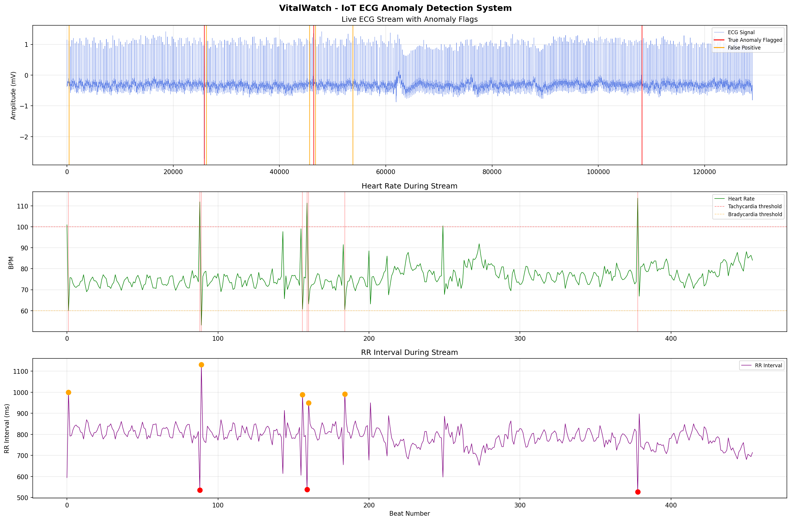

# VitalWatch - IoT ECG Anomaly Detection System

> *Every heartbeat tells a story. VitalWatch listens.*

An end-to-end unsupervised framework for cardiac anomaly detection - trained exclusively on normal rhythm, deployed live via a consumer smartwatch, and evaluated against a 1985 clinical standard it surpasses using zero labelled training data.

**Research paper:** *VitalWatch: An Ensemble-Based Unsupervised Framework for ECG Anomaly Detection with IoT Deployment* - manuscript prepared for submission to IEEE Access / Sensors (MDPI).

---

## The Problem

A wearable device continuously monitors a patient's heart rate. Most beats are normal. A few are not.

The challenge: abnormal cardiac events can represent as little as **0.08% of all beats** in some patients. A model predicting "Normal" for everything achieves high accuracy and misses every dangerous event. Supervised methods require labelled anomalous examples - unavailable before patient encounter in real IoT deployment.

VitalWatch is built around this specific challenge: **detect anomalies without ever seeing one during training.**

---

## Results at a Glance

| Method | Precision | Recall | F1 | Labels Required |
|---|---|---|---|---|
| Pan-Tompkins (1985) - Clinical Baseline | 0.185 | 0.706 | 0.525 | Rule-based |
| Isolation Forest | - | - | 0.352 | Zero |
| Autoencoder (VitalWatch) | 0.646 | 0.205 | 0.549 | Zero |
| **OR Ensemble (VitalWatch)** | **0.638** | **0.210** | **0.556** | **Zero** |
| AND Ensemble (VitalWatch) | **0.750** | 0.080 | 0.144 | Zero |

The OR Ensemble exceeds the Pan-Tompkins clinical baseline (F1 = 0.525 → 0.556) using **zero labelled training data** across 108,098 beats from 46 MIT-BIH records.

The AND Ensemble achieves **precision of 0.750** - when both models simultaneously flag a beat, 3 out of 4 alarms correspond to genuine anomalies.

---

## Dataset

**MIT-BIH Arrhythmia Database** - the gold standard benchmark for ECG algorithm evaluation.

- 48 half-hour ambulatory ECG recordings, 47 subjects
- Sampled at 360 Hz, 11-bit resolution, expert-annotated beat-by-beat
- **46 records used** (102 and 104 excluded - paced beats only)
- **108,098 total beats, 23 unique beat types**
- Class distribution: 69.2% normal, 30.8% abnormal - but with extreme per-record heterogeneity (0.08% to 100% abnormal across individual records)

Streamed directly via `wfdb` - no manual download required.

---

## Feature Engineering

Six features engineered from beat annotation timestamps alone - no raw signal processing required:

| Feature | Formula | Clinical Meaning |
|---|---|---|
| `rr_interval` | (sampleᵢ − sampleᵢ₋₁) / 360 × 1000 | Primary rhythm indicator (ms) |
| `heart_rate` | 60,000 / RR | Instantaneous rate (bpm) |
| `rr_diff` | RRᵢ − RRᵢ₋₁ | Beat-to-beat change; flags premature beats |
| `rolling_mean_rr` | 5-beat sliding window mean | Local rhythm baseline |
| `rolling_std_rr` | 5-beat sliding window std | Local rhythm variability |
| `relative_rr` | RRᵢ / rolling_mean_rr | Patient-normalised deviation |

All features standardised using `StandardScaler` fitted exclusively on normal beats - no statistical leakage.

---

## Models

### Isolation Forest
Unsupervised anomaly detection via random recursive partitioning. Anomalous points in sparse feature-space regions are isolated in fewer splits. `contamination = 0.015`, fixed pre-deployment - no per-patient calibration.

### Feedforward Autoencoder
Trained exclusively on normal beats. Architecture: `Input(6) → Dense(32) → Dense(16) → Dense(32) → Output(6)`. Anomaly threshold: 95th percentile of training reconstruction errors.

### LSTM Autoencoder
Operates on sequences of 10 consecutive beats. Architecture: `LSTM(64) → LSTM(32) → RepeatVector → LSTM(32) → LSTM(64) → TimeDistributed Dense(6)`.

**Signal Dilution Finding:** Single anomalous beats embedded in 10-beat sequences produce diluted mean reconstruction errors insufficient to trigger detection - a fundamental architectural effect, not a hyperparameter issue. Formally:

```
E_sequence = (1/10) × Σ eᵢ ≈ mean(e_normal)   when e₁...e₉ are small
```

This explains substantially reduced LSTM recall and motivates future work on window-level maximum error scoring.

### Ensemble Configurations
- **OR Ensemble** (`IF OR AE`): maximises recall - any signal from either model triggers an alert
- **AND Ensemble** (`IF AND AE`): maximises precision - consensus required

LSTM excluded from ensemble due to signal dilution incompatibility with threshold-based voting.

---

## Key Findings

**1. Signal dilution in LSTM sequence models** - mean reconstruction error aggregation across sequence windows suppresses single-beat anomaly signals. Replacing mean with max error is identified as the most promising fix.

**2. Calibration mismatch vs. patient heterogeneity** - a fixed contamination prior (1.5%) appropriate for single-patient deployment produces systematic under-flagging on high-anomaly records. Per-record anomaly rates span 0.08% to 100% across MIT-BIH. Adaptive thresholding identified as primary avenue for recall improvement.

**3. Training data diversity > model complexity** - Isolation Forest outperformed the LSTM Autoencoder on several records in the 10-record evaluation subset. Expanding training population yields larger generalisation gains than architectural elaboration at current data scales.

---

## IoT Deployment

VitalWatch deployed as a **live Streamlit dashboard** connected to a Noise smartwatch via the **Google Fit API** (`fitness.heart_rate.bpm` endpoint).

- BPM retrieved at 15-minute intervals via optical PPG
- RR intervals computed in real time; all six features engineered on-device
- Pre-trained OR Ensemble performs live anomaly scoring
- Alert log with timestamps, feature values, and per-model flags

Live results presented as proof-of-concept pipeline demonstration. Consumer PPG introduces motion artifacts and temporal resolution limitations absent from clinical ECG - contributing to the 33.3% false positive rate observed in the live session. These are inherent to consumer wearable data quality, not to the VitalWatch methodology.

---

## Dashboard



*Real-time cardiac monitoring: live BPM trace with anomaly markers, alert log with per-model flags (iso_flag / ae_flag), and model status panel.*

---

## Project Structure

```
vitalwatch-iot-anomaly-detection/
│
├── phase1_data_exploration.ipynb         # MIT-BIH loading, EDA, signal visualisation
├── phase2_feature_engineering.ipynb      # RR intervals, heart rate, rolling features (6 total)
├── phase3_anomaly_detection.ipynb        # Baseline Isolation Forest (3 features, 1 record)
├── phase4_model_improvement.ipynb        # Enhanced Isolation Forest (6 features, multi-record)
├── phase4_model_comparison.ipynb         # DBSCAN vs Isolation Forest - why DBSCAN fails here
├── phase5_iot_simulation.ipynb           # Live stream simulation, alert logging, visualisation
├── phase6_autoencoder.ipynb              # Feedforward Autoencoder - reconstruction error anomaly scoring
├── phase7_multi_patient.ipynb            # Multi-patient generalisation across MIT-BIH records
├── phase8_lstm_anomaly_detection.ipynb   # LSTM Autoencoder + signal dilution characterisation
├── phase9_ensemble.ipynb                 # OR/AND ensemble design and comparison
│
├── phase11a_full_dataset_loading.ipynb   # Full 46-record MIT-BIH dataset loading and storage
├── phase11b_extended_evaluation.ipynb    # Extended evaluation across all 108,098 beats
├── phase11c_confusion_matrices.ipynb     # Confusion matrices and F1 heatmap generation
├── phase11d_baseline_comparison.ipynb    # Pan-Tompkins clinical baseline comparison (10 records)
│
├── streamlit_app.py                      # Live IoT dashboard - Google Fit API + OR Ensemble
├── google_fit_auth.py                    # OAuth2 authentication for Google Fit API
│
├── phase11_combined_dataset.parquet      # Full 46-record processed dataset
├── phase11_evaluation_results.csv        # Per-model evaluation metrics
├── phase11_per_record_results.csv        # Per-record F1 scores across all 46 records
├── phase11_record_summary.csv            # MIT-BIH record group summary
│
├── phase11_dataset_distribution.png      # Beat type distribution and class split
├── phase11_confusion_matrices.png        # Confusion matrices - all 4 model configurations
├── phase11_f1_heatmap.png                # Per-record F1 heatmap across 46 records
├── phase11_pr_roc_curves.png             # Precision-Recall and ROC curves
├── phase11_baseline_comparison.png       # VitalWatch vs Pan-Tompkins per-record F1
├── phase11_final_summary.png             # Full evaluation summary dashboard
├── phase7_generalisation.png             # Multi-patient generalisation results
├── phase8_lstm.png                       # LSTM signal dilution visualisation
├── phase9_comparison.png                 # 3-model comparison summary
├── vitalwatch_final.png                  # Live IoT dashboard screenshot
│
├── requirements.txt                      # Python dependencies
└── README.md
```

---

## Setup

```bash
# Create environment
conda create -n vitalwatch python=3.10
conda activate vitalwatch

# Install dependencies
pip install -r requirements.txt

# Launch notebooks
jupyter notebook

# Run live dashboard
streamlit run streamlit_app.py
```

Run notebooks in order: phase1 → phase2 → phase3 → phase4 → phase5 → phase6 → phase7 → phase8 → phase9 → phase11a → phase11b → phase11c → phase11d.

---

## Tech Stack

Python · Pandas · NumPy · Scikit-learn · TensorFlow · Keras · WFDB · Streamlit · Google Fit API · Matplotlib · Jupyter

---

## Research Paper

A full research paper documenting this work has been prepared:

**VitalWatch: An Ensemble-Based Unsupervised Framework for ECG Anomaly Detection with IoT Deployment - A Comparative Study of Isolation Forest, Autoencoder, and LSTM Autoencoder on the MIT-BIH Arrhythmia Database**

*Manoj Prakash, M.Sc. Data Science, Universität Trier, Germany*

Target venues: IEEE Access, Sensors (MDPI). arXiv preprint forthcoming.

---

## What's Next

- [ ] Window-level maximum reconstruction error as LSTM anomaly score (signal dilution fix)
- [ ] Patient-specific adaptive thresholding to overcome calibration mismatch
- [ ] 1D-CNN architecture comparison
- [ ] Higher-frequency wearable ECG integration beyond consumer optical PPG

---

*Built as part of a self-directed research journey in Healthcare ML and IoT systems.*  
*M.Sc. Data Science - Universität Trier, Germany, 2026.*
